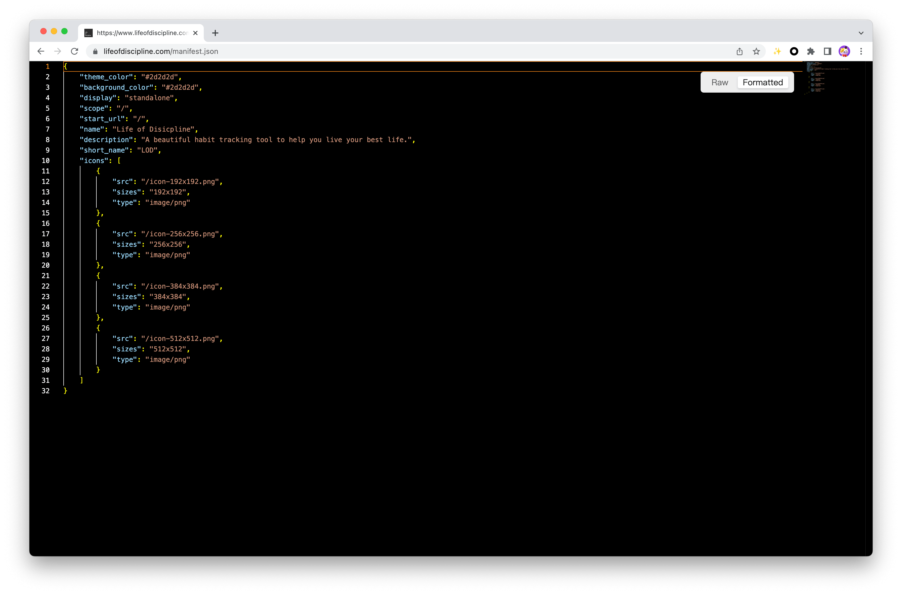

**English** | [中文](./README.zh-CN.md)

<h1 align="center">Prettyprint Source</h1>

✨ Prettyprint Source as a Browser Extension. This extension is used to highlight various types of resource codes, which is convenient for developers to read source code and improve debugging efficiency. It supports common file formats, such as JSON, JavaScript, CSS, etc.

## Installation

  Search 'Prettyprint Source' and installation in [Chrome Webstore Extensions](https://chrome.google.com/webstore/category/extensions), 
  This extension will enabled by default.
## Usage

  Support customize editor options:

* Enable
  * on
  * off
* Theme
  * Visual Studio
  * Visual Studio Dark
  * High Contrast Light
  * High Contrast Dark
* Font Family
  * Default (Consolas, "Courier New", monospace)
  * Monaco
  * Menlo
* Font Size
  * 12 - 16
* Word Wrap
  * on
  * off

## Examples

### JSON

### CSS

## Contributing

### Issues

  [Report issue](https://github.com/whelmin/prettyprint-source/issues/new)

### License
  [MIT License](./LICENSE)

