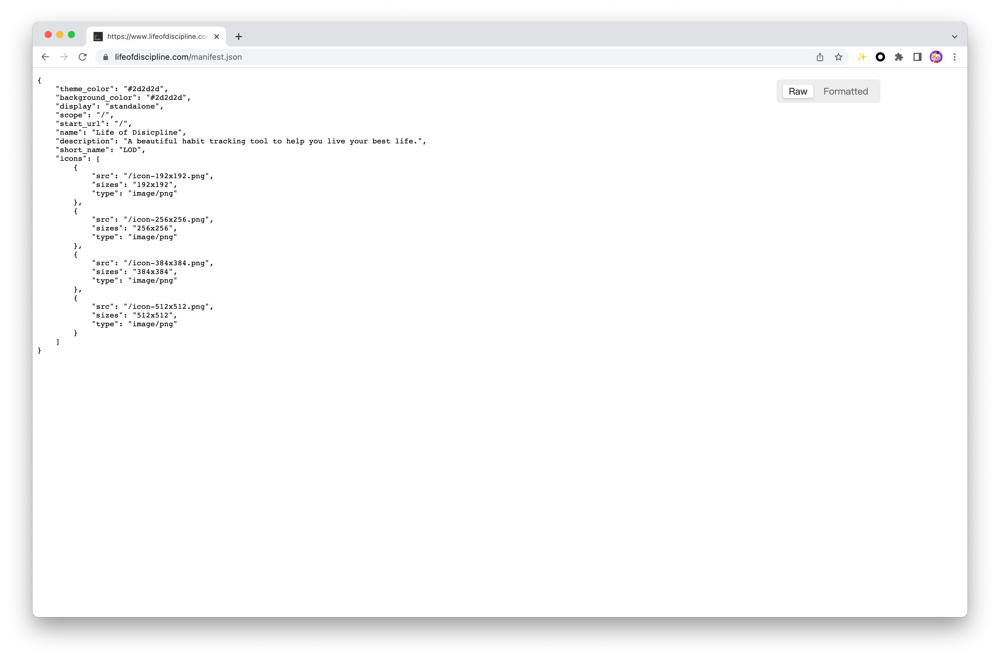
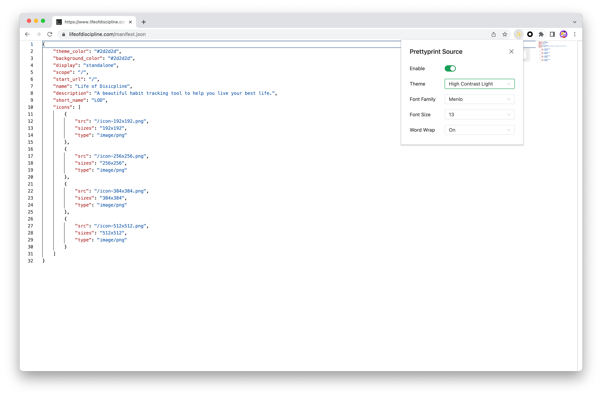
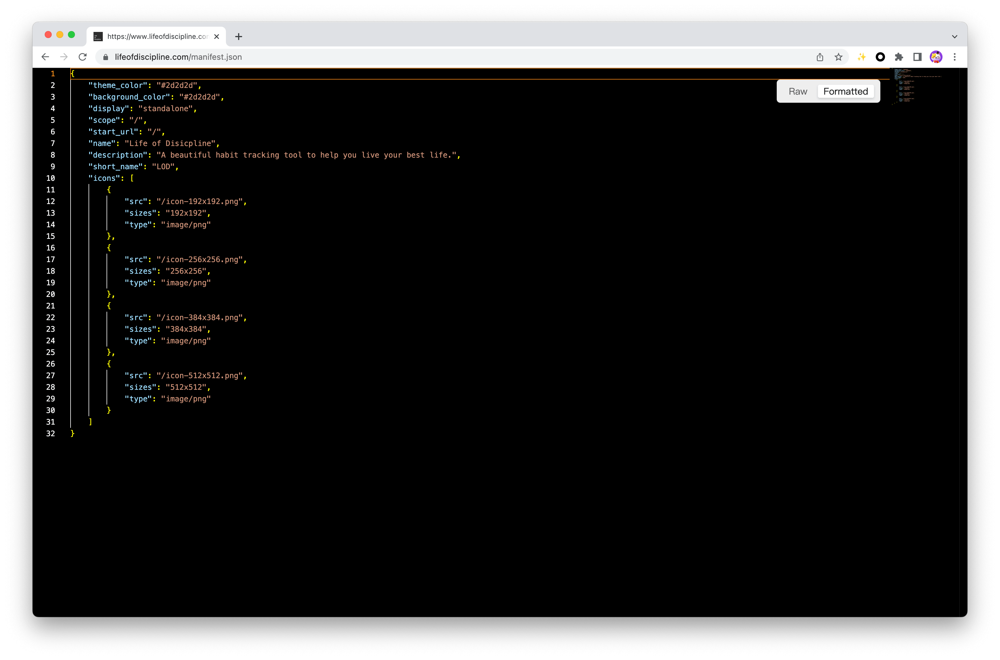
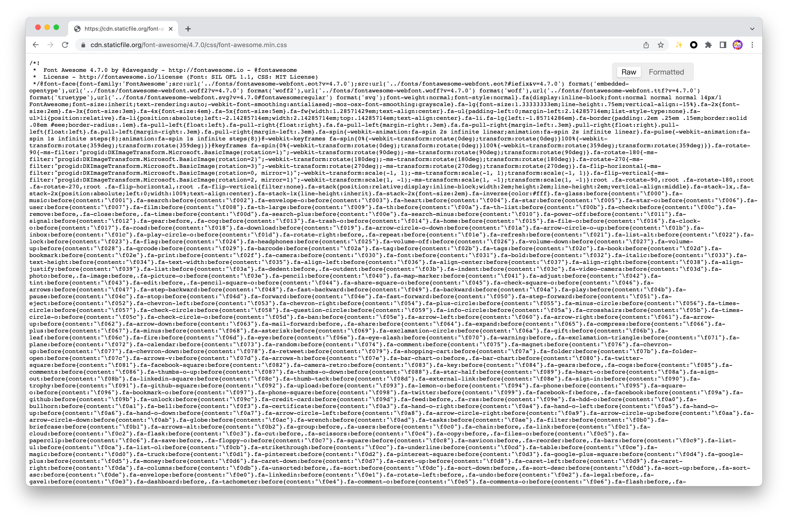
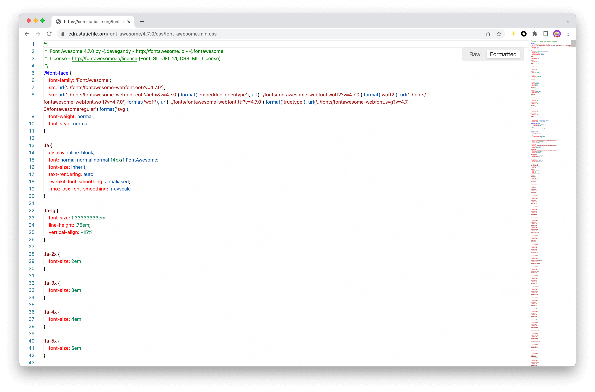
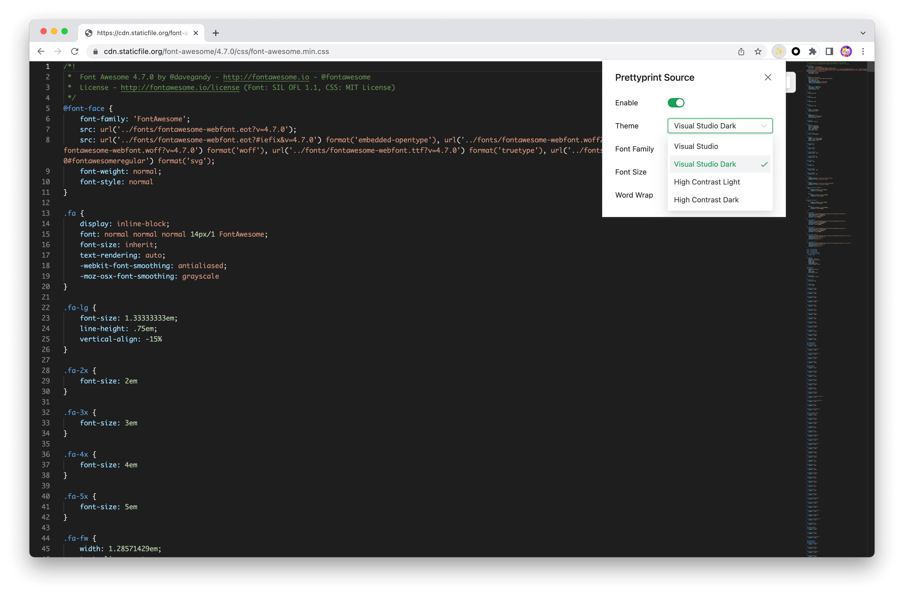

**中文** | [English](./README.md)

<h2 align="center">高亮资源代码插件</h2>

✨ 一款高亮资源代码的浏览器扩展程序，该扩展程序用于高亮各种类型的资源代码，方便开发者阅读源码和提升 debug 效率，支持常见的文件格式，如 JSON、JavaScript、CSS等。

## 安装

  在 [Chrome 应用商店](https://chrome.google.com/webstore/category/extensions) 搜索 Prettyprint Source 关键词，添加至 Chrome，该浏览器扩展程序将会被自动启用。

## 设置

  目前支持以下编辑器选项自定义设定：

* Enable（启用）
  * on
  * off
* Theme （主题）
  * Visual Studio
  * Visual Studio Dark
  * High Contrast Light
  * High Contrast Dark
* Font Family（字符集）
  * Default (Consolas, "Courier New", monospace)
  * Monaco
  * Menlo
* Font Size（字体大小）
  * 12 - 16
* Word Wrap（换行）
  * on
  * off
  
## 示例

### JSON

### CSS

## 贡献

### BUG

  [报告BUG](https://github.com/whelmin/prettyprint-source/issues/new)

### 许可证
  [MIT License](./LICENSE)